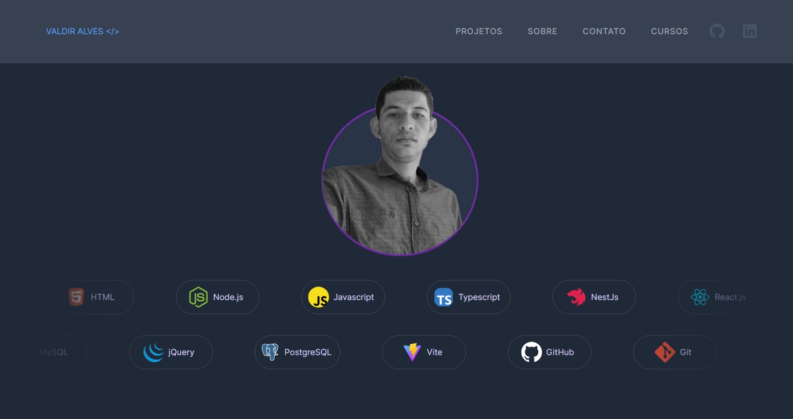

# Portfolio - Valdir Alves

Bem-vindo ao meu portfolio! Este é um projeto que destaca minhas habilidades como desenvolvedor de software e apresenta alguns dos meus trabalhos mais recentes e relevantes. Sinta-se à vontade para explorar e conhecer mais sobre minha jornada no mundo da programação.

## Visão Geral

Este projeto foi desenvolvido com o objetivo de criar um espaço que reflete minha paixão pela tecnologia e minha dedicação ao desenvolvimento de software. Aqui, você encontrará informações sobre minha formação acadêmica, habilidades técnicas, e projetos anteriores que demonstrem minha experiência e capacidade como desenvolvedor.

## Como Acessar

Para acessar o meu portfolio e explorar todos os detalhes, basta clicar [aqui](https://portfolio-valdir-alves3000.vercel.app/).
